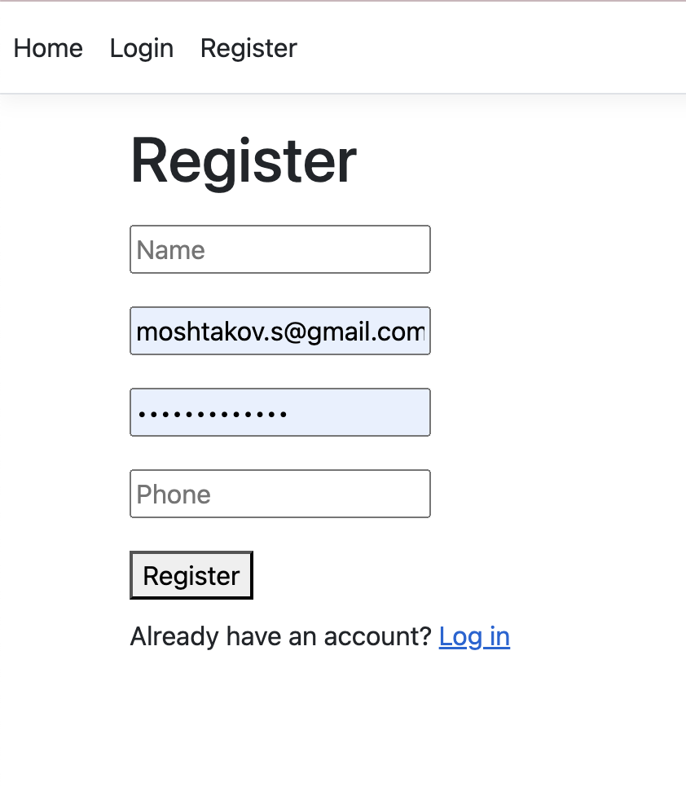
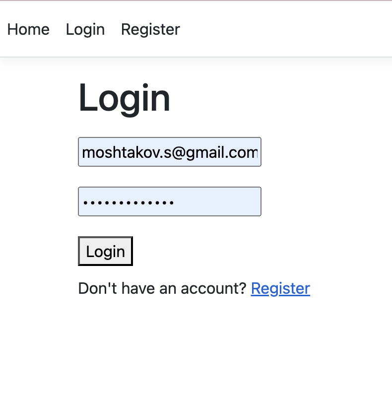
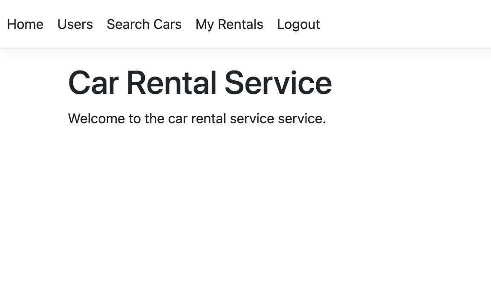
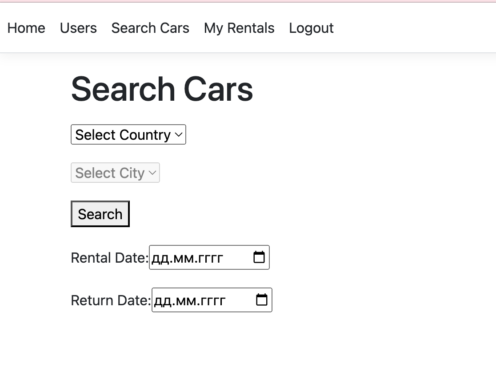
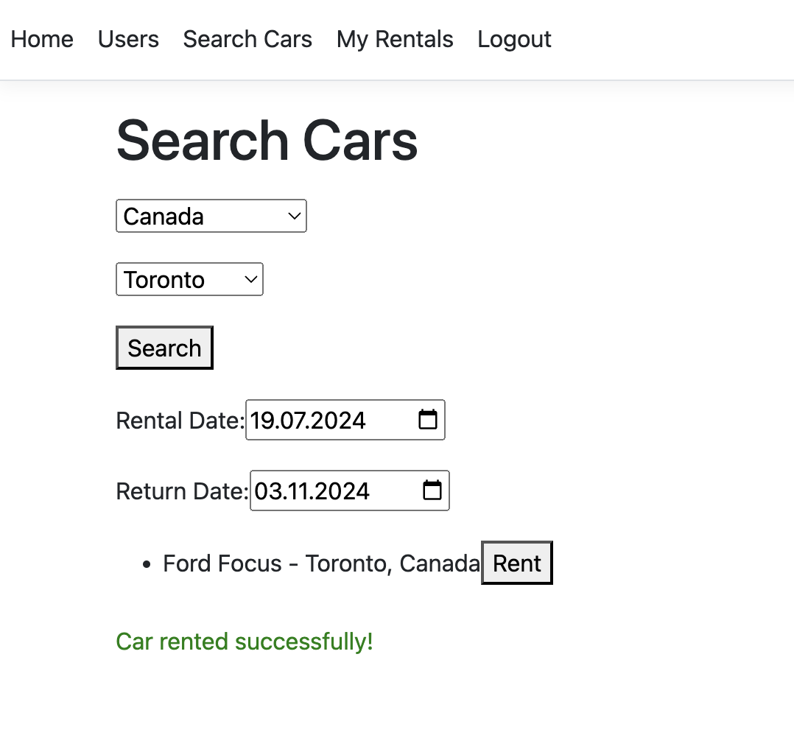
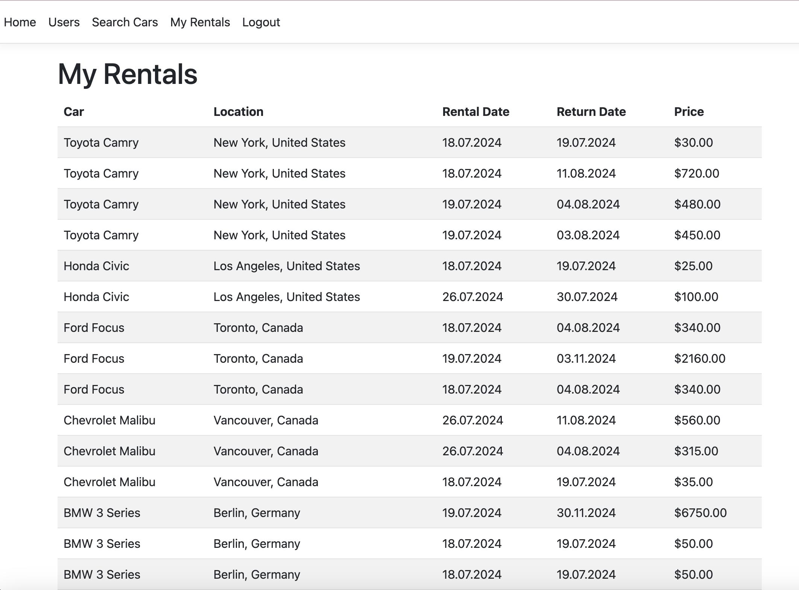
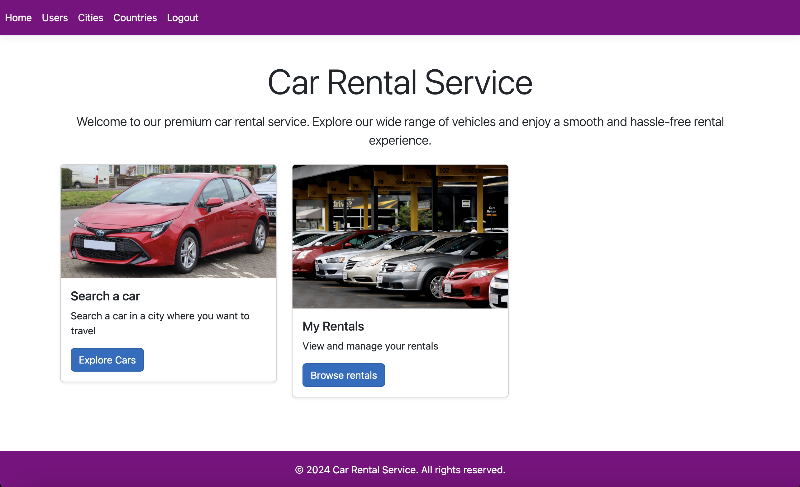
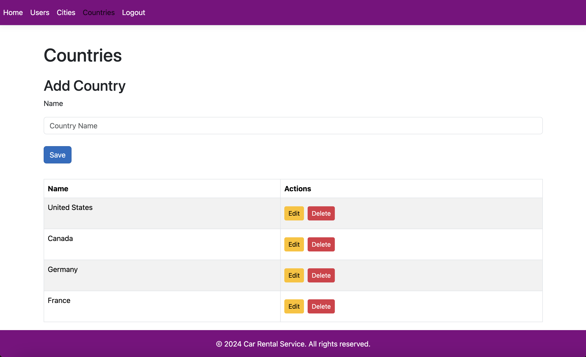
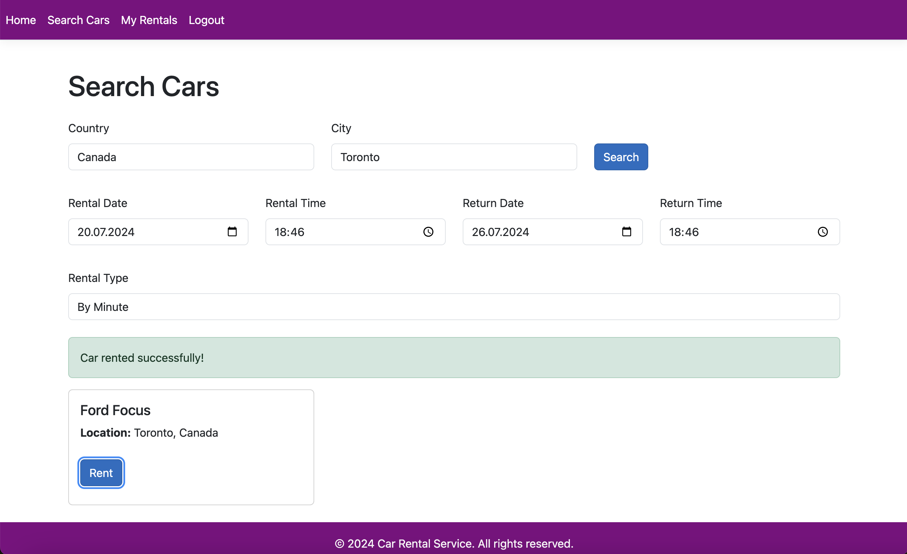

# CarRentalService

Призначення: сервіс для пошуку машин у місті та заказу аренди машини. Машину можна знайти у конкретному місті та країні, вибрати час аренди та замовити. Потім на ваш E-Mail приходе письмо з підтвердженням заказу. Окрім цього ви бачите список аренд. Для адміна доступна функція просмотру користувачів.
Технологія: ASP.Net та Entity Framework для взаємодії з базою данних MySql(так як я розробляю на макє) + React JS в якості Front End.

Рєстрація

Логін

Головна сторінка (поки не так багато інфи)

Сторінка пошуку машин

Успішне замовлення машини

Список усіх замовлень машин.

## Зміни проєкта

Серед змін було додавання можливості для аренди машини по часам та по хвилинам. Також було додано дизайн за допомогою бібліотеки Bootstrap

Головна сторінка

Крад операції у адмінів

Пошук машини

Просмотр списка аренд машин
