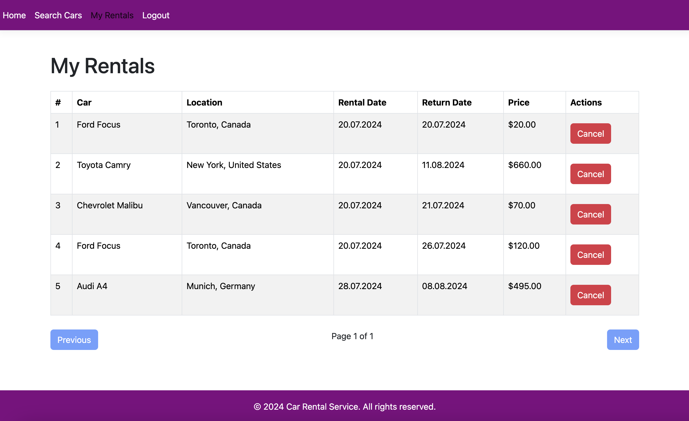

# CarRentalService

Purpose: This service is for finding cars in a city and booking a car rental. You can find a car in a specific city and country, select the rental time, and make a reservation. Then, a confirmation email will be sent to you. Additionally, you can view a list of all rentals. An admin has access to the feature for viewing users.
Technology: ASP.Net and Entity Framework for interacting with the MySQL database (since I am developing on a Mac) + React JS for the front end.

Registration

Login

Home Page

Car Search Page

Successful Car Reservation

List of All Car Reservations.

## Project Changes

Recent changes include adding the ability to rent cars by the hour and minute. A design update was also made using the Bootstrap library.

Home Page

Admin Operations Panel

Car Search

View List of Car Rentals
